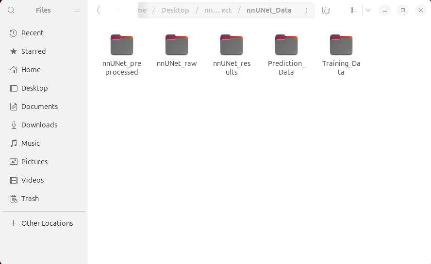
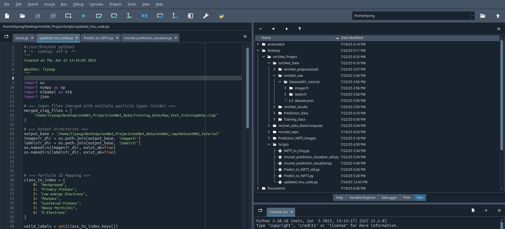
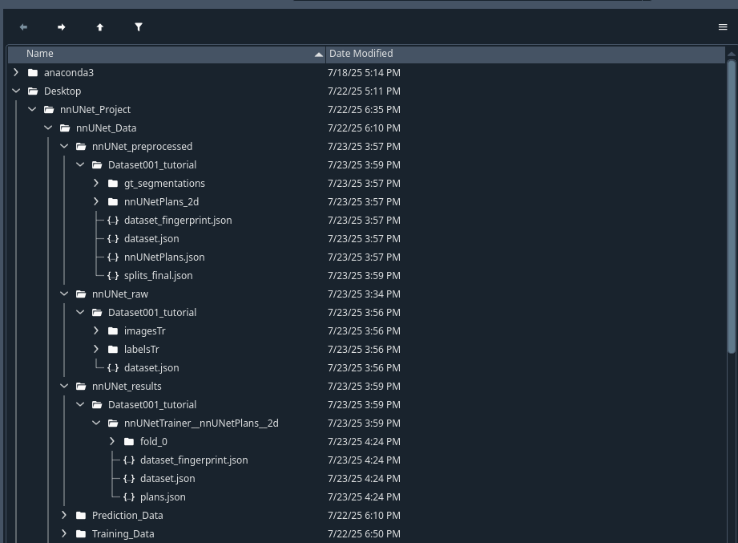
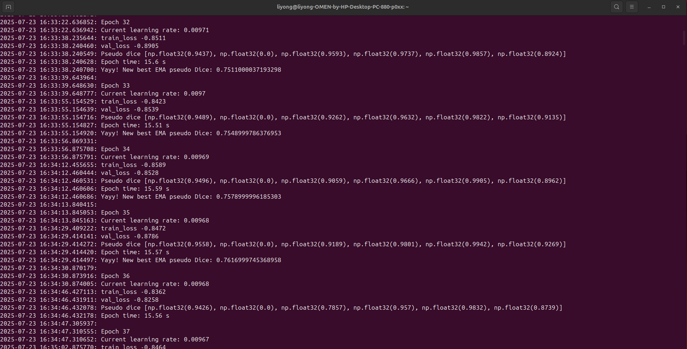
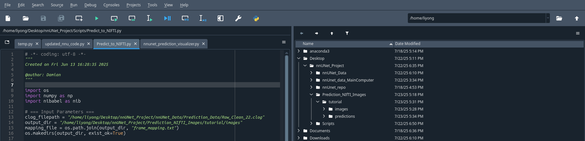
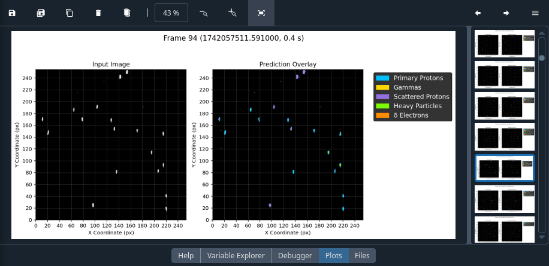

# nnUNet Documentation for Omen PC (Ubuntu)

## Table of Contents
- [nnUNet Documentation for Omen PC (Ubuntu)](#nnunet-documentation-for-omen-pc-ubuntu)
  - [Table of Contents](#table-of-contents)
  - [Installation](#installation)
    - [Setup Process](#setup-process)
  - [Running nnUNet](#running-nnunet)
    - [Upload Training and Prediction Data](#upload-training-and-prediction-data)
    - [Dataset Folder Setup](#dataset-folder-setup)
    - [Preprocessing](#preprocessing)
    - [Training](#training)
    - [Prediction](#prediction)
    - [Plotting Predictions](#plotting-predictions)
  - [Screenshots and Visual Examples](#screenshots-and-visual-examples)
    - [Training and Prediction Data Folders](#training-and-prediction-data-folders)
    - [Spyder Interface Setup](#spyder-interface-setup)
    - [Expected File Structure after Preprocessing](#expected-file-structure-after-preprocessing)
    - [Stopping Training](#stopping-training)
    - [Results after Prediction Step](#results-after-prediction-step)
    - [Prediction Visualization](#prediction-visualization)

## Installation

> **Note:** nnUNet is already installed. This section is for troubleshooting if issues arise. You can skip this section if you don't need it.

### Setup Process

1. **Prerequisites**
   - Make sure Spyder and Anaconda are installed

2. **Create Conda Environment**
   ```bash
   conda create -n nnunet_env python=3.10
   ```

3. **Activate Environment**
   ```bash
   conda activate nnunet_env
   ```

4. **Install PyTorch**
   ```bash
   pip3 install torch torchvision torchaudio --index-url https://download.pytorch.org/whl/cpu
   ```

5. **Install nnUNetv2**
   ```bash
   pip install nnunetv2
   ```

6. **Configure Environment Variables**
   - Edit `.bashrc` file:
     ```bash
     nano ~/.bashrc
     ```
   - Add these lines to the bottom:
     ```bash
     export nnUNet_raw=".../nnUNet_Project/nnUNet_raw"
     export nnUNet_preprocessed=".../nnUNet_Project/nnUNet_preprocessed"
     export nnUNet_results=".../nnUNet_Project/nnUNet_results"
     export nnUNet_compile=0
     ```
> **Note:** The Omen PC uses a GeForce GTX 1070 with a CUDA Capability of 6.1, which is incompatible with the compiler used by the PyTorch version currently installed. nnUNet_compile being set to zero means that we ignore the Triton compiler that would normally optimize the training process.
> 
1. **Optional: Install HiddenLayer**
   ```bash
   pip install --upgrade git+https://github.com/FabianIsensee/hiddenlayer
   ```

2. **Configure Spyder**
   - Go to **Tools → Preferences → Python Interpreter**
   - Select "Use the following interpreter:"
   - Set path to: `.../anaconda3/envs/nnunet_env/bin/python`

3. **Install Spyder Kernels**
   ```bash
   pip install spyder-kernels==3.0.0
   ```

## Running nnUNet

### Upload Training and Prediction Data
([see where in Files you should upload the data](#training-and-prediction-data-folders))

1. Open Files and navigate to `.../nnUNet_Project/Training_Data`

2. **Upload Training Data**
   - Place training `.clog` file in the `Training_Data` folder
   - This data is what nnUNet will train on

3. **Upload Prediction Data**
   - Place prediction `.clog` file in the `Prediction_Data` folder
   - This test data is what nnUNet will make predictions on

### Dataset Folder Setup
([see spyder interface with file structure](#spyder-interface-setup))

1. **Create Dataset Folder**
   - Navigate to the `nnUNet_raw` folder
   - Create a new folder named `Dataset###_name`
     - `###` = 3-digit ID you assign to this training process
     - `name` = any descriptive name
     - Example: `Dataset001_tutorial`

2. **Open Spyder**
   - Launch through terminal (type 'spyder') or through the app

3. **Navigate to Scripts**
   - Click **Files** (middle right, among 'Help,' 'Variable Explorer,' 'Debugger,' 'Plots,' 'Files')
   - Navigate to `.../nnUNet_Project/Scripts`

4. **Configure Training Script**
   - Open `updated_nnu_code.py`
   - Update the following file path variables:
     - `merged_clog_files`: Full path to training `.clog` file
       ```python
       ".../nnUNet_Project/nnUNet_Data/Training_Data/{FILENAME}.clog"
       ```
     - `output_base`: Full path to your dataset folder
       ```python
       ".../nnUNet_Project/nnUNet_Data/nnUNet_raw/Dataset###_name"
       ```

5. **Run Script**
   - Press the green run button at the top of the Spyder IDE
   - You can check that the folder named `Dataset###_name` has the following:
     - `imagesTr` folder
     - `labelsTr` folder
     - `dataset.json` file

### Preprocessing
([see expected file structure after preprocessing](#expected-file-structure-after-preprocessing))

1. **Open Terminal**
   ```bash
   ctrl + alt + T
   ```

2. **Activate Environment**
   ```bash
   conda activate nnunet_env
   ```

3. **Run Preprocessing**
   ```bash
   nnUNetv2_plan_and_preprocess -d ### --verify_dataset_integrity
   ```
   - Replace `###` with your 3-digit dataset ID

4. **Verify Success**
   - Check for new `Dataset###_name` folders in:
     - `nnUNet_Data/nnUNet_preprocessed`
     - `nnUNet_Data/nnUNet_results`

### Training
([see when to stop training](#stopping-training))

1. **Optional: Monitor Memory Usage**
   - You can open a separate terminal and use htop to monitor the PC's memory while training
   ```bash
   htop
   ```

2. **Start Training**
   ```bash
   nnUNetv2_train ### 2d 0
   ```
   - Replace `###` with your dataset ID

3. **Monitor Progress**
   - Training continues until EMA pseudo Dice score stops improving or when validation loss trends upwards
   - It'll say "Yayy! New best EMA pseudo Dice: ..." each time the Dice score improves
   - nnUNet runs up to 1000 epochs by default
   - Training on the Omen PC is slow - stop when the Dice score no longer improves consistently

4. **Stop Training**
   - Press `Ctrl + C` (you might have to do this twice to stop fully)

5. **Rename Checkpoint File**
   - Navigate to: `.../nnUNet_Project/nnUNet_results/Dataset###_name/nnUNetTrainer__nnUNetPlans__2d/fold_0`
   - Rename `checkpoint_best.pth` to `checkpoint_final.pth`
   - **Why:** This file is only automatically renamed when Epoch 1000 is reached, but we usually don't train that long

### Prediction
([see expected file paths and structure after this step](#results-after-prediction-step))

1. **Verify Prediction Data**
   - Ensure correct prediction `.clog` file is in `.../nnUNet_Project/Prediction_Data`

2. **Create Output Folder**
   - Navigate to `.../nnUNet_Project/Prediction_NIfTI_Images/`
       >You may need to create this folder 
   - Create a new folder with some descriptive name (e.g. `dataset001tutorial`)
   - This new folder will store prediction NIfTI images (`tutorial/images` and `tutorial/predictions`)

3. **Configure Prediction Script**
   - In Spyder, navigate to `.../nnUNet_Project/Scripts`
   - Open `Predict_to_NIFTI.py`
   - Update variables:
     - `clog_filepath`: Full path to prediction `.clog` file
       ```python
       ".../nnUNet_Project/Prediction_Data/{FILENAME}.clog"
       ```
     - `output_dir`: Path to new folder with `/images` subfolder
       ```python
       ".../nnUNet_Project/Prediction_NIfTI_Images/{FOLDER_NAME}/images"
       ```
       > **Important:** Include `/images` after folder name. The script will automatically create this subfolder

4. **Run Script**
   - Execute the script
   - You can check that the `images` folder is populated

5. **Generate Predictions**
   ```bash
   nnUNetv2_predict -d ### -i <path_to_prediction_images> -o <path_to_output> -c 2d -f 0
   ```
   
   **Example:**
   ```bash
   nnUNetv2_predict -d ### -i .../nnUNet_Project/Prediction_NIfTI_Images/{FOLDER_NAME}/images -o .../nnUNet_Project/Prediction_NIfTI_Images/{FOLDER_NAME}/predictions -c 2d -f 0
   ```
   
   - The `/predictions` folder will be created automatically

### Plotting Predictions
([see example visualization](#prediction-visualization))

1. **Configure Visualization Script**
   - In Spyder, navigate to `.../nnUNet_Project/Scripts`
   - Open `nnunet_prediction_visualizer.py`
   - Update variables:
     - `image_dir`: Path to images folder
       ```python
       ".../nnUNet_Project/Prediction_NIfTI_Images/{FOLDER_NAME}/images"
       ```
     - `pred_dir`: Path to predictions folder
       ```python
       ".../nnUNet_Project/Prediction_NIfTI_Images/{FOLDER_NAME}/predictions"
       ```

2. **Run Visualization**
   - Execute the script
   - Console should display: "Visualizing: Frame..."

3. **View Results**
   - Click **Plots** (middle right, among 'Help,' 'Variable Explorer,' 'Debugger,' 'Plots,' 'Files')
   - View prediction plots as script runs

## Screenshots and Visual Examples

### Training and Prediction Data Folders

*Location in Files where you should upload your training .clog file and prediction .clog file*  
[Go back up](#upload-training-and-prediction-data)

### Spyder Interface Setup

*Spyder IDE showing the correct file structure, scripts location, and Dataset001_tutorial folder with required subfolders*  
[Go back up](#dataset-folder-setup)

### Expected File Structure after Preprocessing

*You should see three Dataset###_name folders with different contents under nnUNet_raw, nnUNet_preprocessed, and nnUNet_results*  
[Go back up](#preprocessing)

### Stopping Training

*You can stop training when the Dice score stops improving consistently or when the validation loss is trending upward*  
[Go back up](#training)

### Results after Prediction Step

*The file paths in the `Predict_to_NIFTI.py` script and the `Prediction_NIfTI_Images` folder structure should look similar*  
[Go back up](#prediction)


### Prediction Visualization

*Spyder Plots panel displaying particle identification results*  
[Go back up](#plotting-predictions)
